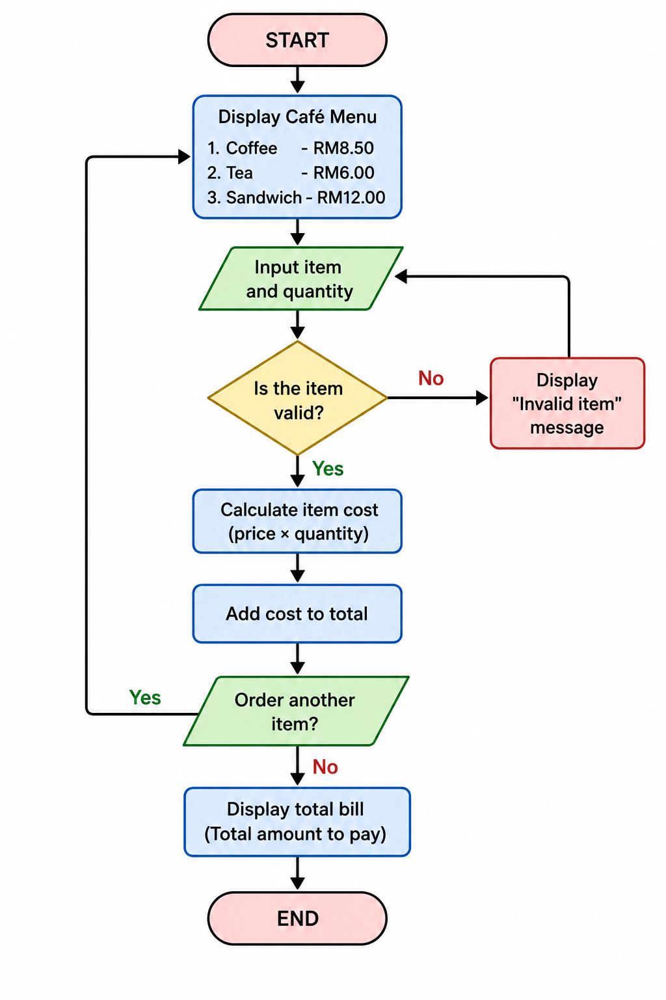

ACTIVITY
1. Answer below questions.

 1.1. Define the problem statement
 A small cafe needs a program to calculate a customer's bill automatically. The program should allow the cashier to select menu items, calculate the total price, and display the final bill instead of calculating it manually.

 1.2. What are the Inputs?
 Customer's choice of items and Quantity of each item

 1.3. What are the outputs?
 How much does the items cost, and the total amount to pay in RM

 1.4. What would be the typical process flow?

 1.5. What are the constraints?

 Only the available menu items can be selected:
  Coffee (RM 8.50)
  Tea (RM 6.00)
  Sandwich (RM 12.00)
  Quantity must be greater than 0.
  Invalid menu choices should not be accepted.
  Prices are fixed.

2. How do you decompose the problem into smaller tasks?
   1- Display the menu
   2- Get the customer's item choice
   3- Validate the item selected.
   4- Get the quantity.
   5- Calculate the item's cost.
   6- Add the cost to the total bill.
   7-  Ask if the customer wants to order another item.
   8- Display the final total.

3. Write a pseudocode

START

Set total = 0

Display café menu

Repeat
    Ask customer to choose an item
    Ask customer for quantity

    If item is Coffee
        cost = 8.50 × quantity
    Else if item is Tea
        cost = 6.00 × quantity
    Else if item is Sandwich
        cost = 12.00 × quantity
    Else
        Display "Invalid item"
        Continue

    total = total + cost

    Ask if customer wants another item
Until answer is No

Display total bill

END