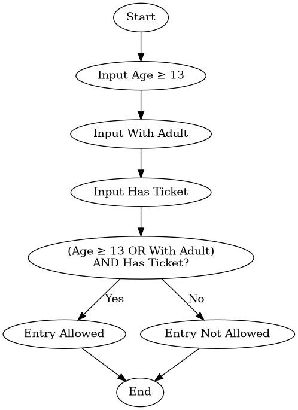
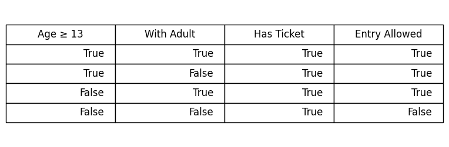

ACTIVITY
1. Identify the Components:

1.1 What are the inputs?
1.2 What is the process?
1.3 What is the output?

2. Design the Algorithm

2.1 Create the diagram using draw.io / canva / etc.
2.2 Complete the truth table.
2.3 Design an Algorithm (The Step-by-Step Solution).
2.4 Create Pseudocode.

3. Evaluate Expression:

3.1 Test with some input samples.

4. Update files using git & push into repository.
w2_tutorial.md

# Analytical Thinking and Boolean Logic

# Movie Theater Entry Checker

---

## **Activity 1: Identify the Components**

---

### What are the Inputs?
**Answer:**

- Age ≥ 13
- With Adult
- Has Ticket

### What is the Process?
**Answer:**

Check if the user:
- Is 13 years old or older OR is accompanied by an adult
- AND has a valid ticket

Boolean Expression:


(Age ≥ 13 OR With Adult) AND Has Ticket

### What is the Output?

**Answer:**

Entry Allowed = True
Entry Allowed = False

## **Activity 2: Design the Algorithm**

---

### The Flow




### The Truth Table

**Answer:**




### Design an Algorithm (The Step-by-Step Solution)

1. Start
2. Input Age ≥ 13
3. Input With Adult
4. Input Has Ticket
5. Check if (Age ≥ 13 OR With Adult) AND Has Ticket
6. If the condition is True, display "Entry Allowed"
7. Else, display "Entry Not Allowed"
8. End

### Create Pseudocode

```text
START

INPUT Age13

INPUT WithAdult

INPUT HasTicket

IF (Age13 OR WithAdult) AND HasTicket

    DISPLAY "Entry Allowed"

ELSE

    DISPLAY "Entry Not Allowed"

END IF

END